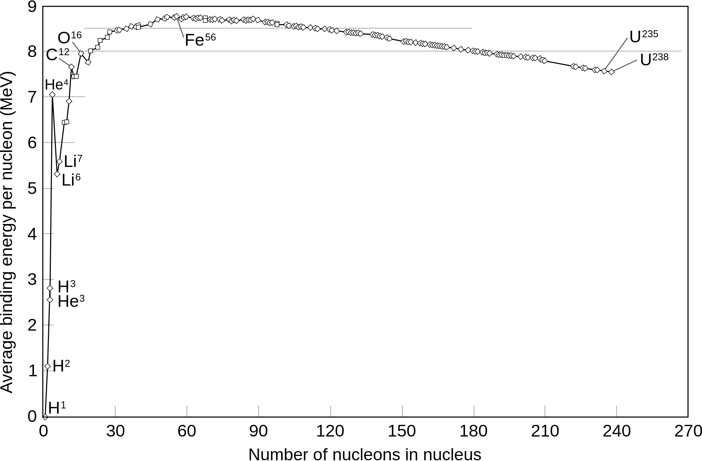

---

tags: Permanent
---

# 4,5b - Binding Energy and Mass Defect

Mass defect is the difference between the actual weight of an atom and the weight of its constituents. It is often denoted as $\Delta M=(Zm_{p}+Nm_{n})-M_{A}$. This difference is accounted by the binding energy of an atom, which is the energy required to break apart an atom back into its constituents. 

Some notable atoms are the helium-4, carbon-12, and iron-56 ([4,5c - Magic Numbers & Helium Stability](4,5c%20-%20Magic%20Numbers%20&%20Helium%20Stability.md)md)md)). Helium-4 has a strangely high binding energy, which is surpassed next by carbon-12. Iron-56 is the most stable nucleus, thus all fis[4,5b,2a - Fission](4,5b,2a%20-%20Fission.md)on.md)on)) and fusion[^1] tends towards iron-56, as in a star’s core[y.png)

This binding energy can be calculated by $E=mc^{2}$, where $c=2.9979\times 10^{8}\text{m/s}$. Energy is also measured in joules and mass in ki[4,5a - The Helium Nucleus](4,5a%20-%20The%20Helium%20Nucleus.md)cleus.md)cleus)

[^1]: What is fission, and what is fusion?
[^2]: What kind of environment is needed to allow fusion to happen? Can fission also happen in the core of stars?