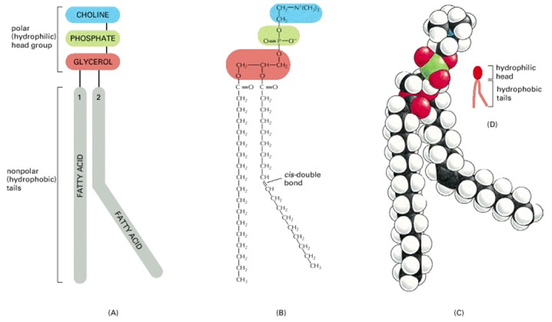

# 2022-09-19

- Pathogens are just a little bit of all the bacterium. They also cause diseases
- Bacteria are microscopic (0.1 to 5 um)
- Bacteria are prokaryotic (no nucleus, no membrane bound organelles), also has plasmids

- Cell walls are peptidoglycan

- These are part of the lipid bilayer. Tails are hydrophobic, heads are opposites.
- Shapes of bacterium and movement
- **Look at pili, and bacteria DNA fishing**
- Virus (20 to 300 nm)
- Literally just a RNA/DNA hull
- Also viral structures
	- Helical
	- Icosahedral
	- Envelope
	- Complex