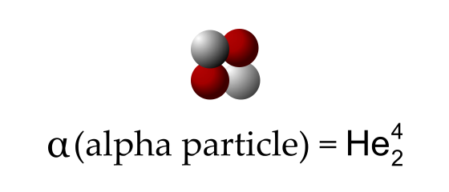

# Alpha Decay #Literature 
- Radioactive decay is a process that atoms undergo to become more stable, by releasing energy/particles
- Alpha decay releases alpha particles ($\alpha$ particles), which are identical to a helium nucleus (two protons and two neutrons)
- It is extremely slow, short-reaching, and not penetrative, however, it is extremely ionising.
- If an alpha-emitter comes into contact with cells (such as eating, breathing, or injecting), it can cause lasting cellular damage. 

Type of Decay | General Formula (A is atomic Mass, Z is atomic number)
--- | ---
Alpha Decay | $^A_{Z}X\to^{A-4}_{Z-2}Y+^4_{2}\alpha$

[4 - Alpha Decay](../3%20Permanent%20Notes/4%20-%20Alpha%20Decay)

---
# Bibliography
- _Alpha decay—Energy Education_. (n.d.). Retrieved August 29, 2022, from [https://energyeducation.ca/encyclopedia/Alpha_decay](https://energyeducation.ca/encyclopedia/Alpha_decay)
- _Alpha Decay_. (n.d.). Retrieved 29 August 2022, from [https://www.atomicarchive.com/science/physics/alpha-decay.html](https://www.atomicarchive.com/science/physics/alpha-decay.html)