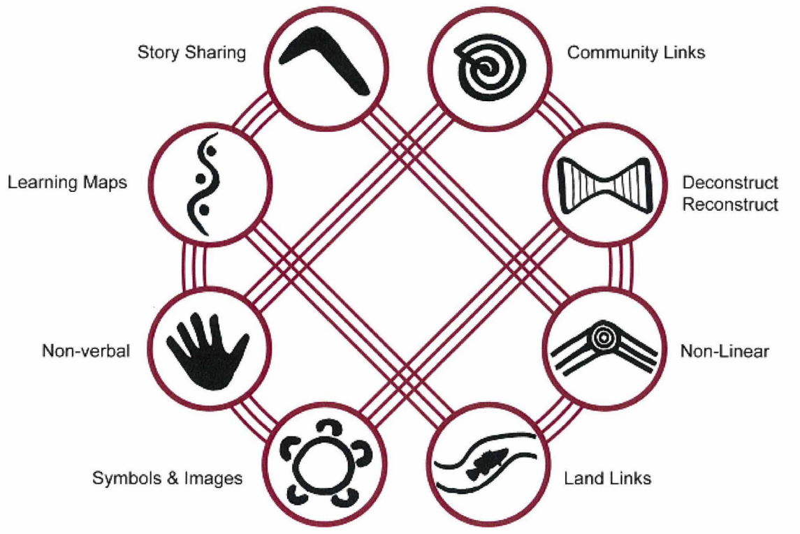

# Teaching and Aboriginal #Literature 
- Language shapes learning, and learning should be moulded by language; this is a strong pedagogy.
- Aboriginal languages, though different, have some similarities, such as the concept that autonomy and social guidance should be balanced.
- When the pedagogy of two cultures overlap, and this is accounted for, valuable learning occurs.
- When information is integrated into stories, it can facilitate better learning.
	- Context plays a major role in learning. What is the use of learning independent, isolated bits of information if it cannot be connected with other pieces of information?
- Nature and geographical landmarks can act as a map or inspiration for a project.
	- The road to learning is not one that goes straight to the end, but one that winds and curves. The best path is not always the shortest one, but the one that allows us to learn as much as possible.[^1]
	- The course may be influenced by the weather.
- ~~Silence acts as a good learning method, as it allows us to consolidate our learning, and~~ allows experience to take over as a teacher.
	- Learning does not have to be verbal, rather, it can be enhanced when students are encouraged to finding meaning in the gaps, tones, motions, as these ultimately say more than words can.
- Non-verbal signs are also a great way to learn, such as the image found underneath, which shows how these aspects are not static steps but interconnected dynamic processes.
	- Rather than affiliating words to other words, it may be more useful to tie them to symbols and images.
	- These can represent concepts and ideas where language fails us.
- Learning, just like Land, twists and turns. Embracing this, one can learn more.
	- Land is the context of Aboriginal society. Learning means nothing without the land.
- Teaching can be likened to shapes, some are cyclic, others branched out.
	- Connect disciplines together, make concepts inter-disciplinary.
	- Do not jump from one thing to another. Go from one place to another.
- Tasks are easier to do if we have a clear visualisation of what we are to achieve by the end, and my backtrack.
	- You can show people what to do, and how the example did it, but you can’t do it for them. They will not learn otherwise.
	- Lead with example, teach with basics, set them free.
- The cultures and communities of the students are to be prioritised, and everything they learn should be meaningful in some way.
	- All cultures are to be respected, even minors ones, and it should not lean to heavily to any culture.

[3,c - Teaching and Aboriginal](../3%20Permanent%20Notes/3,c%20-%20Teaching%20and%20Aboriginal)

---
# Bibliography
Yunkaporta, Tyson. ‘Aboriginal Pedagogies at the Cultural Interface’. Pdoc, James Cook University, 2009. [https://researchonline.jcu.edu.au/10974/](https://researchonline.jcu.edu.au/10974/).

[^1]: Surprisingly similar to hypertext gardening.