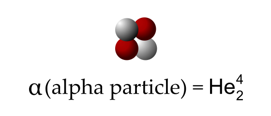

# Nuclear Decay

## Alpha Decay

 Radioactive decay is the process that atoms undergo to become more stable by releasing energy or particles. A type of this is alpha decay, which releases alpha particles ($\alpha$ particles), which is identical to a helium nucleus (two protons and two neutrons).

Alpha decay is extremely slow, short-reaching, and not penetrative, which means that alpha-emitters are relatively safe, and able to be stopped by a sheet of paper. However, it is extremely ionising due to its mass, meaning that it can wreak havoc on cells when it comes into close contact with them.

Type of Decay | General Formula (A is atomic Mass, Z is atomic number)
--- | ---
Alpha Decay | $^{A}_{Z}X\to^{A-4}_{Z-2}Y+^{4}_{2}\alpha$

## Why does it decay?
 
 As nuclei become larger and larger, the strong nuclear force between the protons weaken (as the distance between protons length), which allows electromagnetic force to become the dominant force, which causes the nucleus to become unstable. To make the nucleus more stable, the atom releases these $\alpha$ particles so that it can shorten the distances between protons in an attempt to become more stable.
 
## Why specifically a helium nucleus?

Alpha decay is the most common form of cluster decay, a type of decay where a nucleus splits into two or more smaller clusters of neutrons and protons. Its frequency is a result of the special properties of the helium nucleus. The helium nucleus is extremely stable and has a incredibly high binding energy. 

On top of that, the protons and neutrons inherently form pseudo-helium nuclei inside of another nucleus, and thus, when decaying, split off a helium nucleus.

### Binding Energy and Mass Defect

Mass defect is the difference between the actual weight of an atom and the weight of its constituents. It is often denoted as $\Delta M=(Zm_{p}+Nm_{n})-M_{A}$. This difference is accounted by the binding energy of an atom, which is the energy required to break apart an atom back into its constituents. 

Some notable atoms are the helium-4, carbon-12, and iron-56. Helium-4 has a strangely high binding energy, which is surpassed next by carbon-12. Iron-56 is the most stable nucleus, thus all fission and fusion tends towards iron-56, as in a star’s core.

This binding energy can be calculated by $E=mc^{2}$, where $c=2.9979\times 10^{8}\text{m/s}$. Energy is also measured in joules and mass in kilograms.

## Why are larger particles less penetrative?

$\alpha$ particles are significantly larger than $\beta$ particles and $\gamma$ rays, but also has significantly less penetration. However, this (may) seem counter-intuitive. A wrecking ball can more easily break through a wall than a bullet, and still have more energy left over. However, this is not what penetration is.

Penetration is the ability for a particle to *pass through* a substance, not the ability to *break through*. In this regard, a smaller particle will have an easier time “navigating” its way through a substance, and thus will be able to pass through more easily, whilst an $\alpha$ particle will have a harder time doing so, as it will get caught up in that substance. 

### Why are more ionising particles less penetrative?

To add to the limitation that size plays on a the penetration of a particle, the ionisation plays a further role. A particle that ionises and interacts with matter more frequently also loses more energy than one that ionises less, and thus more ionising particles are less penetrative and vice versa.

## After Decay

An atom undergoes decay to become more stable, however, even after the decay, the atom may still remain unstable. In this case, it will continue to undergo more decay. This is the case of Uranium-238, which $\alpha$ decays into Thorium-234, which $\beta$ decays into Protactinium-234.

## Harms of Ionising Radiation

Ionising radiation is able to destroy the internal processes of a cell, which can lead to many illnesses, such as vomiting, nausea, and fatigue, as well as an increase in the probability of cancer in later life. If one is subject to a large dosage of radiation is a short time, they may develop **acute radiation syndrome**, which is a more dangerous form of radiation poisoning. 

## Beta Decay

Beta decay is another way that unstable nuclei can achieve stability. It occurs when neutrons transform into a proton (positron) and a electron (negatron), increasing stability by increasing the proton to neutron ratio. The electron is tiny, and so it can be ejected from the nucleus as an incredibly high speed[^1]. This is the $\beta$ particle.

Beta decay has higher penetration, as the smaller particle allows it to fit through more gaps in a surface than the $\alpha$ particle. However, it has a lower ionisation ability as it needs to not only be closer due its size, but also because it has a weaker charge.

Type of Decay | General Formula (A is atomic Mass, Z is atomic number)
---  | ---
Alpha Decay | $^A_{Z}X\to^A_{Z+1}Y+^0_{-1}\beta$

It often appears with gamma radiation. A prime example of beta decaying substance would be bismuth-214.

### The Truth behind beta decay

> Everything here on out is extension.

Throw everything you know about positrons and beta decay out, because it is all wrong[^1]. Positrons are actually positively charged electrons, an “anti-electron”. Beta decay is a simplification, and does not make a positron and an electron.

There exists three different modes of beta decay: positive beta decay ($\beta^+$), negative beta decay ($\beta^-$), and electron capture. Negative beta decay is the most common of these, and is the one in 4,2a - Beta Decay (P). It occurs when a neutron transforms into a proton, releasing an electron and an anti-neutrino[^2], with the general formula of: $^A_{Z}X\to^A_{Z+1}Y+^0_{-1}\beta+^0_{0}\overline{\nu}$.

Positive decay is when a proton transforms into a neutron[^3] and releases a positron and a neutrino, coming in the general formula: $^A_{Z}X\to^A_{Z-1}Y+^0_{+1}\beta+^0_{0}\nu$. Electron capture is also when a proton transforms into a neutron, however, it consumes one of the electrons in the inner (K) electron shell, only releasing a neutrino. It’s general formula is: $^A_{Z}X+^0_{-1}e\to^A_{Z-1}Y+^0_{0}\nu$ 

## Beta or Alpha decay

>$\beta^-$, $\beta^+$, and $\alpha$ decay are all things that atoms undergo to become more stable, however, why? Why do some atoms undergo $\beta^-$ and others $\alpha$ decay?

In the above graph, the line of black squares indicates stable atoms, and it acts as a divider between $\beta^-$ and $\beta^+$/$\alpha$ decay. $\beta^-$ decay always occurs to the left of the stability line, as the conversion of a neutron to a proton will move the nucleus right-down on the graph. This will mean that the nuclei will only become more stable if it was already on the left of the stability line. The opposite is true for $\beta^+$ decay. 

As for $\alpha$ decay, as it will lead to the loss of both two neutrons and two protons, and thus will move parallel (towards the origin) to the N=Z line. This means that it will only become more stable when it is on the right of stability line.

## Gamma Decay 
Gamma ($\gamma$) decay is yet another form of radioactive decay. However, unlike the other forms of decay, $\gamma$ decay occur not because it a nuclear is unstable, as even stable nuclei can undergo $\gamma$ decay. Rather, $\gamma$ decay makes an atom unexcited.

It is denoted in the form $^{ Am }_{Z}X\to^{ A }_{Z}X+^{ 0 }_{0}\gamma$. Note that $^{ Am }$ indicates that the atom is excited, and that the parent nucleus does not change. Gamma decay often accompanies other types of decay.

When compared to X-rays, it is essentially the same, except that X-rays originate from the electron cloud and gamma rays from the nucleus.

### Excited Atoms

A ground state (for an atom) is the state containing the lowest possible energy, hence being the most stable formation. An excited state is a state where an atom contains more energy that this ground state. This usually entails that there are electrons that occupy a higher electron orbital, meaning that there is excess energy within the system of the atom. The electron will release this energy in the form of a X-ray.

A similar principle can be applied to the nucleons within a nucleus. Protons and neutrons can occupy a higher energy **nuclear shell**, and when returning to its ground state, it will release a gamma ray.