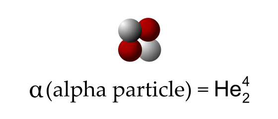

# 4 - Alpha Decay
Radioactive decay is the process that atoms undergo to become more stable by releasing energy or particles ([4,4a - After Decay (P)](4,4a%20-%20After%20Decay%20(P).md)md[8 - How a Nuclear Reactor Works](8%20-%20How%20a%20Nuclear%20Reactor%20Works.md)ks.md)ks)). A type of this is alpha decay, which releases alpha[4,a - Why does it release alpha particles](4,a%20-%20Why%20does%20it%20release%20alpha%20particles.md)icles.md)icles)) ($\alpha$ particles), which is identical to [4,5a - The Helium Nucleus](4,5a%20-%20The%20Helium%20Nucleus.md)0Nucleus.md)0Nucleus)) (two protons and two article.png)

Alpha decay is extremely slow, short-reachin[4,3a - Why larger particles are less penetrative (P)](4,3a%20-%20Why%20larger%20particles%20are%20less%20penetrative%20(P).md)ative%20(P).md)ative%20(P))), which means that alpha-emitters are relatively safe, and able to be stopped by a sheet of paper. However, it is extremely ionising due to its mass, meaning that it can wreak havoc on cells when it comes [4,6a - Harms of Ionising Radiation](4,6a%20-%20Harms%20of%20Ionising%20Radiation.md)ng%20Radiation.md)ng%20Radiation)).

Type of Decay | General Formula (A is atomic Mass, Z is atomic number)
--- | ---
Alpha Decay | $^{A}_{Z[4,2a - Beta Decay (P)](4,2a%20-%20Beta%20Decay%20(P).md)eta%20Decay%20(P).md)eta%20Decay%20(P)) »